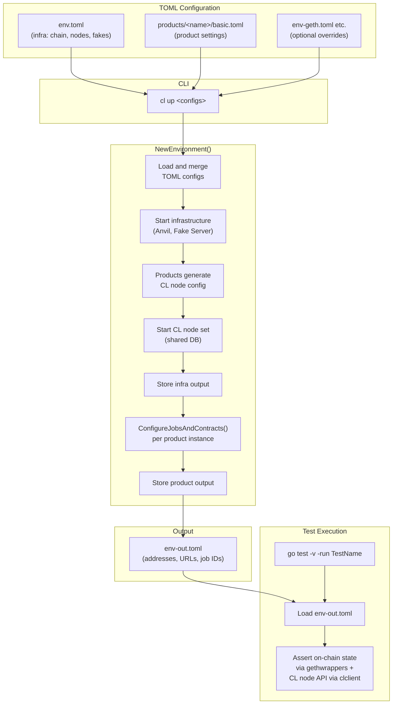
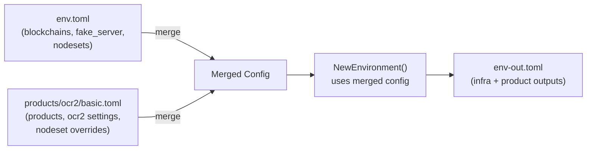
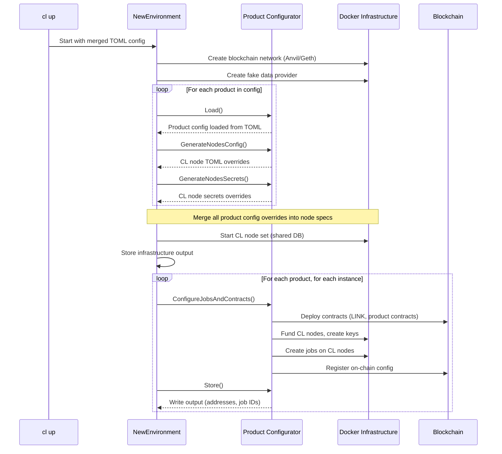
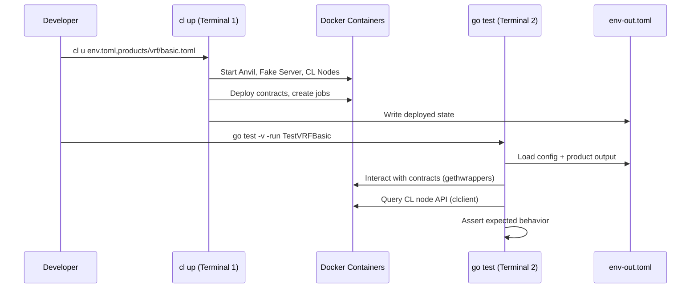
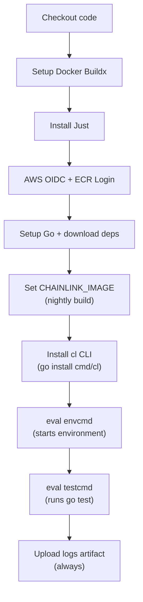

# Devenv Architecture

## Overview

`devenv` is a self-contained Go module (`github.com/smartcontractkit/chainlink/devenv`) that provides a Docker-based development and testing environment for Chainlink products. It orchestrates local blockchain networks, Chainlink nodes, mock external adapters, and product-specific contract deployments.

Key design principles:

- **Dependency isolation** -- devenv does NOT import `github.com/smartcontractkit/chainlink/v2` or any of its child packages. This keeps the test environment decoupled from the core node codebase.
- **TOML-driven configuration** -- all infrastructure and product settings are declared in composable TOML files that merge left-to-right.
- **Two-phase testing** -- environment setup (CLI) and test execution (`go test`) are separate processes, connected by a shared `env-out.toml` output file.
- **Product abstraction** -- each Chainlink product implements a common `Product` interface, making it straightforward to add new products.

The module depends on the [Chainlink Testing Framework (CTF)](https://github.com/smartcontractkit/chainlink-testing-framework) for Docker orchestration, CL node HTTP clients, and observability tooling.

## High-Level Architecture



## Configuration System

The configuration system uses composable TOML files merged via the `CTF_CONFIGS` environment variable.

### Merge Semantics

When `cl up env.toml,products/ocr2/basic.toml` runs, it sets `CTF_CONFIGS=env.toml,products/ocr2/basic.toml`. The `Load[T]()` function reads each file left-to-right, decoding into the same struct. Later files override earlier keys while preserving keys they do not mention.



### Config Layers

| Layer               | File                         | Purpose                                                                    |
| ------------------- | ---------------------------- | -------------------------------------------------------------------------- |
| Base infrastructure | `env.toml`                   | Chain type/ID, fake server image, node count and images                    |
| Product config      | `products/<name>/basic.toml` | Product name, instances, product-specific settings, node count override    |
| Chain override      | `env-geth.toml`              | Switch from Anvil to Geth                                                  |
| Image override      | `env-cl-rebuild.toml`        | Build CL image from local Dockerfile                                       |
| Runtime output      | `env-out.toml`               | Generated after `cl up` -- contains deployed addresses, node URLs, job IDs |

### Root Config Struct

The root configuration type (`Cfg` in `environment.go`) defines the top-level TOML schema:

```go
type Cfg struct {
    Products    []*ProductInfo      `toml:"products"`
    Blockchains []*blockchain.Input `toml:"blockchains"`
    FakeServer  *fake.Input         `toml:"fake_server"`
    NodeSets    []*ns.Input         `toml:"nodesets"`
    JD          *jd.Input           `toml:"jd"`
}
```

Each product configurator has its own struct that gets decoded from the same TOML files (e.g., `[[ocr2]]` sections are decoded by the OCR2 `Configurator`).

## The Product Interface

Every product in devenv implements this interface from `interface.go`:

```go
type Product interface {
    Load() error
    Store(path string, instanceIdx int) error
    GenerateNodesSecrets(ctx, fs, bc, ns) (string, error)
    GenerateNodesConfig(ctx, fs, bc, ns) (string, error)
    ConfigureJobsAndContracts(ctx, instanceIdx, fs, bc, ns) error
}
```

### Product Lifecycle



### Registered Products

| Name           | TOML key         | Config dir                | Nodes | Contracts deployed                                 |
| -------------- | ---------------- | ------------------------- | ----- | -------------------------------------------------- |
| Cron           | `cron`           | `products/cron/`          | 1     | None (bridge + cron job only)                      |
| Direct Request | `direct_request` | `products/directrequest/` | 1     | LINK, Oracle, TestAPIConsumer                      |
| Flux Monitor   | `flux`           | `products/flux/`          | 5     | LINK, FluxAggregator                               |
| OCR2           | `ocr2`           | `products/ocr2/`          | 5     | LINK, OCR2Aggregator                               |
| Automation     | `automation`     | `products/automation/`    | 5     | LINK, Registry (2.0-2.3), Registrar, Upkeeps       |
| VRF            | `vrf`            | `products/vrf/`           | 1     | LINK, BlockHashStore, VRFCoordinator, VRFConsumer  |

### Adding a New Product

1. Create `products/<name>/configuration.go` implementing the `Product` interface
2. Create `products/<name>/basic.toml` with default config
3. Add a `case "<name>"` in `newProduct()` in `environment.go`
4. Create `tests/<name>/smoke_test.go` that reads `env-out.toml` and asserts behavior
5. Add a matrix entry in `.github/workflows/devenv-nightly.yml`

## The `cl` CLI

The CLI (`cmd/cl/`) is a Cobra-based tool that drives environment lifecycle.

### Commands

| Command                     | Alias  | Description                                                                          |
| --------------------------- | ------ | ------------------------------------------------------------------------------------ |
| `cl up [configs]`           | `cl u` | Spin up environment from TOML configs (default: `env.toml,products/ocr2/basic.toml`) |
| `cl down`                   | `cl d` | Tear down all Docker containers                                                      |
| `cl restart [configs]`      | `cl r` | Tear down then recreate                                                              |
| `cl test <folder> <filter>` |        | Run `go test` in `tests/<folder>` with `-run <filter>`                               |
| `cl obs up [-f]`            |        | Start observability stack (Loki/Prometheus/Grafana; `-f` for full)                   |
| `cl obs down`               |        | Stop observability stack                                                             |
| `cl bs up`                  |        | Start Blockscout block explorer                                                      |
| `cl bs down`                |        | Stop Blockscout                                                                      |
| `cl shell` / `cl sh`        |        | Interactive shell with autocomplete                                                  |

### How `cl up` Works

1. Sets `CTF_CONFIGS` env var from the argument (or defaults to `env.toml,products/ocr2/basic.toml`)
2. Sets `TESTCONTAINERS_RYUK_DISABLED=true` to prevent container cleanup on CLI exit
3. Calls `devenv.NewEnvironment(ctx)` with a 7-minute timeout
4. `NewEnvironment` loads config, starts infra, runs product configurators, writes `env-out.toml`

### Interactive Shell

`cl sh` starts a REPL with tab-completion for commands and config file paths. It executes commands by invoking the same Cobra command tree in-process.

## Fakes (Mock External Adapters)

Fakes are a lightweight HTTP service that replaces real external adapters and data feeds during testing. The fake server runs as a Docker container on port 9111.

### Why Fakes Exist

Chainlink nodes need external data sources (external adapters, price feeds, Mercury endpoints). Instead of depending on real services, fakes provide deterministic, controllable responses that make tests reliable and fast.

### Routes by Product

| Product        | Route                           | Behavior                                                    |
| -------------- | ------------------------------- | ----------------------------------------------------------- |
| Cron           | `POST /cron_response`           | Returns `{"data": {"result": 200}}`                         |
| Direct Request | `POST /direct_request_response` | Returns `{"data": {"result": 200}}`                         |
| OCR2           | `POST /ea`                      | Returns current EA value (default 200)                      |
| OCR2           | `POST /juelsPerFeeCoinSource`   | Returns JUELS/LINK ratio                                    |
| OCR2           | `POST /trigger_deviation`       | Changes the EA return value (query param `?result=<value>`) |
| Automation     | `POST /api/v1/reports/bulk`     | Returns mock Mercury/DataStreams reports                    |
| Automation     | `GET /client`                   | Returns mock Mercury client config                          |

### Building and Using Fakes

```bash
just build-fakes                     # Build image locally as chainlink-fakes:latest
just push-fakes <aws_registry>       # Build for linux/amd64 and push to ECR
```

In CI, the `FAKE_SERVER_IMAGE` environment variable overrides the image used in `env.toml`.

## Test Architecture

Tests follow a two-phase pattern where environment setup and test execution are independent processes.



### Test File Pattern

Every smoke test follows the same structure:

1. **Load output** -- read `../../env-out.toml` to get infrastructure and product config

```go
in, err := de.LoadOutput[de.Cfg](outputFile)
productCfg, err := products.LoadOutput[<product>.Configurator](outputFile)
```

2. **Setup cleanup** -- save container logs on test completion

```go
t.Cleanup(func() {
    framework.SaveContainerLogs(...)
})
```

3. **Create clients** -- ETH client for on-chain interaction, CL client for node API

```go
c, auth, _, err := products.ETHClient(ctx, wsURL, feeCap, tipCap)
cls, err := clclient.New(in.NodeSets[0].Out.CLNodes)
```

4. **Interact with contracts** -- use gethwrappers directly (never through `chainlink/v2` wrappers)

```go
consumer, err := solidity_vrf_consumer_interface.NewVRFConsumer(addr, c)
```

5. **Assert with polling** -- use `require.EventuallyWithT` to poll until expected state

```go
require.EventuallyWithT(t, func(ct *assert.CollectT) {
    // check on-chain state or job runs
}, 2*time.Minute, 2*time.Second)
```

### Dependency Rule

Tests in `devenv/tests/` must NOT import:
- `github.com/smartcontractkit/chainlink/v2`
- `github.com/smartcontractkit/chainlink/integration-tests`
- `github.com/smartcontractkit/chainlink/deployment`

Allowed imports are:
- `github.com/smartcontractkit/chainlink/devenv` (this module)
- `github.com/smartcontractkit/chainlink-testing-framework/framework` (CTF)
- `github.com/smartcontractkit/chainlink-evm/gethwrappers` (contract bindings)
- `github.com/smartcontractkit/libocr` (OCR bindings)
- Standard library and third-party libraries (testify, go-ethereum, etc.)

## CI Integration

System tests run nightly via [`.github/workflows/devenv-nightly.yml`](../.github/workflows/devenv-nightly.yml).

### Workflow Structure

The workflow uses a GitHub Actions matrix strategy where each entry defines:

| Field               | Purpose                                                          |
| ------------------- | ---------------------------------------------------------------- |
| `display_name`      | Human-readable test name                                         |
| `envcmd`            | Command to set up the environment (runs from `devenv/`)          |
| `testcmd`           | Command to run the tests (runs from `devenv/tests/<tests_dir>/`) |
| `runner`            | GitHub Actions runner label                                      |
| `tests_dir`         | Subdirectory under `devenv/tests/`                               |
| `logs_archive_name` | Name for the uploaded log artifact                               |

### Execution Flow



### Adding a Test to CI

Add a new entry to the `matrix.include` array:

```yaml
- display_name: "Test <Product> Smoke"
  testcmd: "go test -v -timeout 10m -run <TestFunction>"
  envcmd: "cl u env.toml,products/<product>/basic.toml"
  runner: "ubuntu-latest"
  tests_dir: "<product>"
  logs_archive_name: "<product>"
```
